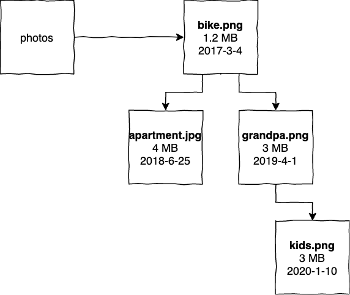

# DynamoDB with Go #4

Last time we looked at how Composite Primary Keys can improve our ability to query the DynamoDB. This time we'll focus on how indexes can help us even more with our access patterns.

In episode #3 of DynamoDB we built an oversimplified filesystem model. Let me share with you a single item from that filesystem so that we are on the same page on how it looked.

| Directory | Filename       | Size |
| ---       | ----           | ---- |
| finances  | report2017.pdf | 1MB  |

If you recall we were able to query the filesystem in a following ways:
- Give me a single file from a directory
- Give me the whole directory

Thanks to the fact that some of the files have year in their names we are able to get files older/younger than given date. [Look here how we did it](../episode3/post.md#query3).

As we are testing this on staging, product person looks up our shoulder and sees that we are querying based on the creation time and she absolutely loves it. Except for one thing.

## You cannot really expect from our clients to put creation date of the file in the name

Now we have additional requirement. We need to be able to sort files inside directory based on their creation date. This is new **access pattern**. 

This isn't SQL, we cannot simply use `WHERE` and `ORDER BY` clauses and query just anything without additional work. The tool for this job in DynamoDB is an **index**.

## [Indexes](#indexes)

Table in the DynamoDB can have only single pair of main Partition and Sort Keys. It's called Primary Key. They are important because they are entry point for queries. 

But why are they the entry point? In order to answer that question let's think of how DynamoDB stores its data. First of all there is a partition key which is used to determine _on which partition data is stored._ The DynamoDB calculates hash function based on partition key and finds that partition. All items that share the same partition key (so called item collection) are stored within single B-Tree data structure. What is important about B-Tree is that it allows to query data in sorted order. Sort Key is important here because it is the criteria by which items are sorted in the tree. Let's have a look.



I used Binary Search Tree instead of B-Tree to simplify but they share the same property of being sortable and this is enough to build your intuition around the topic.

Data that corresponds to image above is presented here:

| Directory (PK) | Filename (SK)      | Size   | CreatedAt                     |
| ---            | ----               | ----   | ---------                     |
| photos         | bike.png           | 1.2MB  | 2017-03-04 00:00:00 +0000 UTC |
| photos         | apartment.jpg      | 4MB    | 2018-06-25 00:00:00 +0000 UTC |
| photos         | grandpa.png        | 3MB    | 2019-04-01 00:00:00 +0000 UTC |
| photos         | kids.png           | 3MB    | 2020-01-10 00:00:00 +0000 UTC |
  
Our entry point here is the ability to get items from `photos` directory and sort them by filename. This is exactly reflected in the image because tree is constructed in a way that allow to sort only by `filename`. If we would like to have different entry point - we need to introduce an index.
  
**Indexes enhance ability to query the table by introducing additional Partition Keys and Sort Keys.**
  
DynamoDB has two types of indexes: Local Secondary Indexes (LSI) and Global Secondary Indexes (GSI). *Secondary* means that they are an addition to Primary Key.

### [Local Secondary Index](#LSI)
LSI has the same Partition Key as Primary Key but different Sort Key. This allows us to sort items by additional attribute. In order to do that DynamoDB has to store additional - reorganized tree. Each sorting pattern needs to have it's own tree.

Our additional access pattern was sorting by `created_at` attribute. This means additional tree sorted by `created_at`. Let's have a look at the image to warp our heads around that.


LSI needs to have the same Partition Key as the table itself - this is why it's *local*. We can use the same partition to find both Primary Sort Key and Sort Key for the LSI. Important limitation of LSI is that it needs to be created when the table is created. There can be up to 5 LSIs on single table.

### [Global Secondary Index](#GSI)
GSI is different. It allows to have arbitrary Partition Key and Sort Key for the same table. Let's construct an index where Partition Key is `size` and `filename` is Sort Key. This would allow to do query that would group photos by their size.


We no longer have the possibility to keep an index close to Primary Key because Partition Key on the index is completely different. We need to construct a new data structure. That's why this index is global - it lives somewhere else so to speak. GSIs are important because they allow to query the table in just any way you imagine. As opposed to LSIs, GSIs can be created anytime in the table lifetime. There can be up to 20 GSIs per table.

## [Database layout](#database-layout)

We will concentrate on solving our business problem and we will create LSI that allows to sort by `created_at`.

```yaml
Resources:
  FileSystemTable:
    Type: AWS::DynamoDB::Table
    Properties:
      AttributeDefinitions:
        - AttributeName: directory
          AttributeType: S
        - AttributeName: filename
          AttributeType: S
        - AttributeName: created_at
          AttributeType: S
      KeySchema:
        - AttributeName: directory
          KeyType: HASH
        - AttributeName: filename
          KeyType: RANGE
      LocalSecondaryIndexes:
        - IndexName: ByCreatedAt
          KeySchema:
            - AttributeName: directory
              KeyType: HASH
            - AttributeName: created_at
              KeyType: RANGE
          Projection:
            ProjectionType: ALL
      BillingMode: PAY_PER_REQUEST
      TableName: FileSystemTable
``` 

This is very similar to what we had before in the third epiode, there are only two differences. First difference is that we have new big section `LocalSecondaryIndexes` where an index lives. I called it `ByCreatedAt` because this is essentially what I want to do - I want to query by the creation time. If we look inside we will see something very similar to the Composite Primary Key definition. There is `KeySchema` with `RANGE` and `HASH` keys. Second difference is that there is new attribute definition. Because `RANGE` key of the `CreatedAt` index uses `created_at` attribute it has to be defined.

```go
type item struct {
	Directory string    `dynamodbav:"directory"`
	Filename  string    `dynamodbav:"filename"`
	Size      string    `dynamodbav:"size"`
	CreatedAt time.Time `dynamodbav:"created_at"`
}
```

The `item` changed as well. It has new attribute - `CreatedAt`.
 
## [Query #1 - Photos taken from 2019](#query1)

Initial setup for all queries will be the same. It's just:

```go
ctx := context.Background()
tableName := "FileSystemTable"
db, cleanup := dynamo.SetupTable(t, ctx, tableName, "./template.yml")
defer cleanup()
```

Now let's build key condition expression.

```go
expr, err := expression.NewBuilder().
  WithKeyCondition(
    expression.KeyAnd(
      expression.KeyEqual(expression.Key("directory"), expression.Value("photos")),
      expression.KeyGreaterThanEqual(expression.Key("created_at"), expression.Value(time.Date(2019, 1, 1, 0, 0, 0, 0, time.UTC))))).
  Build()
```

I need to provide the exact directory for the query. Additionally I am using `KeyGreaterThanEqual` in order to take advantage of the index. From perspective of this expression however the index is not visible. Hypothetically with table where `directory` is the Partition Key and `created_at` is the Sort Key it would be valid expression as well. The point here is that we cannot have many sort keys on the table - we need to use indexes for that - but it kind of works as additional sort key and it doesn't affect expression very much.

```go
out, err := db.QueryWithContext(ctx, &dynamodb.QueryInput{
  ExpressionAttributeNames:  expr.Names(),
  ExpressionAttributeValues: expr.Values(),
  KeyConditionExpression:    expr.KeyCondition(),
  TableName:                 aws.String(table),
  IndexName:                 aws.String("ByCreatedAt"),
})
assert.Len(t, out.Items, 2)
```

As you can see we need to specify that we are using the `ByCreatedAt` index. If we don't specify that - the DynamoDB will complain that key condition expression is missing its sort key (`filename`) and has other field instead (`created_at`). At the end I am just checking if result consists of 2 items.

## [Query #2 - Photos taken from 2017 to 2018](#query2)

The query looks exactly the same as in first query (hence I'im skipping it), but the Key Condition Expression used to construct this query uses new operator which I wanted to show you.

```go
expr, err := expression.NewBuilder().
  WithKeyCondition(
    expression.KeyAnd(
      expression.KeyEqual(expression.Key("directory"), expression.Value("photos")),
      expression.KeyBetween(expression.Key("created_at"),
        expression.Value(time.Date(2017, 1, 1, 0, 0, 0, 0, time.UTC)),
        expression.Value(time.Date(2019, 1, 1, 0, 0, 0, 0, time.UTC))))).
  Build()
``` 
It's that simple - you just need to set lower and upper bounds for your search and that's all - you get photos from 2017 to 2018.

## [Query #3 - Newest photo](#query3)

Because an index stores items in the order - sorted by its Sort Key (of the index) - we can access data in a new way. We need to have the Key Condition Expression that will specify only the Partition Key - so that we are in photos directory.

```go
expr, err := expression.NewBuilder().
  WithKeyCondition(expression.KeyEqual(expression.Key("directory"), expression.Value("photos"))).
  Build()
```

As the Key Condition Expression got simpler, the query itself got a little bit more complicated.

```go
out, err := db.QueryWithContext(ctx, &dynamodb.QueryInput{
  ExpressionAttributeNames:  expr.Names(),
  ExpressionAttributeValues: expr.Values(),
  KeyConditionExpression:    expr.KeyCondition(),
  TableName:                 aws.String(table),
  IndexName:                 aws.String("ByCreatedAt"),
  ScanIndexForward:          aws.Bool(false),
  Limit:                     aws.Int64(1),
})
```

First of all we need to specify that we wan't to traverse index backwards because by default index keeps data in ascending order - we do it with the `ScanIndexForward` parameter. Second of all we want to limit query results to single item. Without that bit - we would return all of the photos from newest to oldest one.

At the end we just verify whether item we obtained is really the newest one.

```go
var items []item
err =  dynamodbattribute.UnmarshalListOfMaps(out.Items, &items)
assert.Equal(t, 2020, items[0].CreatedAt.Year())
```
 
## [Summary](#summary)
This episode was about indexes. First we built an intuition on how they work and then we used Local Secondary Index to query by additional attribute.

Indexes are esessential concept in the DynamoDB and we will see more of them when working with more complicated data models.

Once again - I am inviting you to clone this repository and play with queries by yourself!